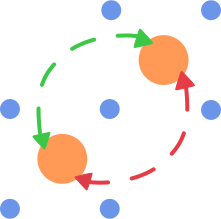

<h1 align="center">PYET-MC</h1>
<p align="center">
  
</p>

<h3 align="center">A library to model energy transfer between lanthanide ions</h3>
<h1 align="center">Get in contact</h1>
<p align="center">
    <a href="https://github.com/JaminMartin"></a>
    &nbsp;
    <a href="https://www.linkedin.com/in/jamin-martin-87448a167/"></a>
    &nbsp;
</p>

## Table of Contents
- [Introduction](#introduction)
- [Installation](#installation)
- [Usage](#usage)
  - [Generating a structure & plotting](#generating-a-structure--plotting)
  - [Energy transfer models](#energy-transfer-models)
    - [Modelling energy transfer processes](#modelling-energy-transfer-processes)
    - [A note on caching](#a-note-on-caching)
    - [Adding your own energy transfer model](#adding-your-own-energy-transfer-model)
  - [Fitting experimental data to energy transfer models](#fitting-experimental-data-to-energy-transfer-models)
  - [Troubleshooting](#troubleshooting)
- [Referencing this project](#referencing-this-project)  
- [License](#license)

# Introduction
Collection of tools for modelling the energy transfer processes in lanthanide-doped materials. 

Contains functions for visualising crystal structure around a central donor ion, subroutines for nearest neighbour probabilities and monte-carlo based multi-objective fitting for energy transfer rates. This package aims to streamline the fitting process while providing useful tools to obtain quick structural information. The core function of this library is the ability to simultaneously fit lifetime data for various concentrations to tie down energy transfer rates more accurately. This allows one to decouple certain dataset features, such as signal offset/amplitude, from physical parameters, such as radiative and energy transfer rates. This is all handled by a relatively straightforward API wrapping the Scipy Optimise library.

# Installation
Currently, pyet is not on the PyPI package repository; this will be the case until this project is more stable. It is still a work in progress. However, if you do wish to use pyet in its current form, it is as simple as the following:

Setup a new Python virtual environment (I personally recommend Conda) and specify Python 3.11
```
conda create --name 'name of your env' python=3.11
```
Activate this virtual environment with "conda activate 'name of your env'" This ensures the package doesn't overwrite any of your existing Numpy/Scipy python libraries
Clone this repository in a location of your choosing, or download as a zip file and extract it
```
git clone git@github.com:JaminMartin/pyet-mc.git
```
In the terminal, cd into this directory and tell pip to install this package
```
path/to/my/package/ pip install . 
```
To test that this was successful, create a new Python file (where ever you would like to use pyet, not from within the pyet source code).
Try to import pyet; assuming no error messages appear, pyet has been successfully installed in your virtual environment
```python
import pyet 
```
# Usage 

## Generating a structure & plotting
Firstly a .cif file must be provided. How you provide this .cif file is up to you! We will take a .cif file from the materials project website for this example. However, they also provide a convenient API that can also be used to provide cif data. It is highly recommended as it provides additional functionality such as XRD patterns. Information on how to access this API can be found here https://next-gen.materialsproject.org/api. 
We can create our structure with the following code. However, this may differ if you are using the materials project API. 
```python
 KY3F10 = Structure(cif_file= 'KY3F10_mp-2943_conventional_standard.cif')
```
We then need to specify a central ion which all subsequent information will be calculated in relation to. 
```python
KY3F10.centre_ion('Y')
```
This will set the central ion to be a Ytrrium ion and yields the following output:
```
Central ion is Y
```
Now we can request some information! We can now query what ions and how far away they are from that central ion within a given radius. 
This can be done with the following:

```python
 KY3F10.nearest_neighbours_info(3.2)
``` 
Output:
```
Nearest neighbours within radius 3.2 Angstroms of a Y ion:
Species = F, r = 2.386628 Angstrom
Species = F, r = 2.227665 Angstrom
Species = F, r = 2.386628 Angstrom
Species = F, r = 2.227665 Angstrom
Species = F, r = 2.386628 Angstrom
Species = F, r = 2.227665 Angstrom
Species = F, r = 2.227665 Angstrom
Species = F, r = 2.386628 Angstrom

```
We can plot this if we would like, but we will increase the radius for illustrative purposes. We can use the inbuilt plotting for this.
```python
 KY3F10.structure_plot(5)   
```
Which yields the following figure:
<p align="center">

</p>


We can also specify a filter only to show ions we care about. For example, we may only care about the fluoride ions. 
```python
filtered_ions = ['F']

KY3F10.structure_plot(5, filter = filtered_ions)  
```
This gives us a filtered plot:
<p align="center">

</p>

In future, the colours will be handled based on the ion, much like the materials project and moved to plotly; the current plotting is purely a placeholder for functionality. This is a WIP.
## Energy transfer models
The energy transfer process can be modelled for a particular configuration of donor and acceptor ions with the following exponential function 
$$I_j(t) = e^{-(\gamma_r + \gamma_{tr,j})t},$$
here $t$ is time, $\gamma_r$ is the radiative decay rate and $\gamma_{tr,j}$ is the energy transfer rate for this confuration. Assuming a single-step multipole-multipole interaction (currently, the only model implemented), $\gamma_{tr,j}$ may be modelled as a sum over the transfer rates to all acceptors $\gamma_{tr,j}$ takes the form: 

$$\gamma_{tr,j} = C_{cr} \sum_i \left(\frac{R_0}{R_i}\right)^s$$

Here $R_i$ is the distance between donor and acceptor, $C_{cr}$ is the energy-transfer rate to an acceptor at $R_0$ the nearest-neighbour distance, and $s$ depends on the type of multipole-multipole interaction ($s$ = 6, 8, 10 for dipole-dipole, dipole-quadrupole and quadrupole-quadrupole interactions respectively). The term $\sum_i \left(\frac{R_0}{R_i}\right)^s$ forms the basis of our Monte Carlo simulation; we will refer to this as our interaction component. The lifetime for an ensemble of donors can be modelled by averaging over many possible configurations of donors and acceptors:

$$I(t) =\frac{1}{n} \sum_{j=1}^n  e^{-(\gamma_{r} + \gamma_{tr,j})t}$$

Where $n$ is the number of unique random configurations. We can also define an average energy transfer rate $\gamma_{av}$ defined as:
$$\frac{1}{n}\sum_{j=1}^n \gamma_{tr,j}$$
This is a useful value for comparing hosts at a similar concentration. 

### Modelling energy transfer processes
Note: Currently, there is only one energy transfer process implemented so this section may be subject to change in future releases. 

Consider the crystal structure we previously generated. We wish to "dope" that structure with some lanthanide ions randomly around some central donor ion. We will replace our previously defined "central yttrium atom" with a samarium. We will then randomly (based on the concentration of the dopant in the crystal) dope samarium ions around this central samarium ion. This step needs to be performed many times to "build up" many random unique samarium-samarium donor-acceptor configurations. When the number of random configurations is large enough, this should accurately represent a physical crystal sample. This is the Monte-Carlo aspect of our energy transfer analysis. 

To generate our random samples, we utilise the interaction class. This class takes in our structure class and provides additional methods for calculating our interaction components and more specific plotting methods for doped crystals. We can enact this class simply by passing our structure to the interaction class:
```python
crystal_interaction = Interaction(KY3F10)
```

```python
coords = crystal_interaction.distance_sim(radius=10, concentration = 15, dopant='Sm')
```
This returns a list of radial distances in angstroms of the dopant samarium ions about the central samarium donor ion.
```
[8.28402747 7.17592429 7.17592429 9.33368811 8.28402747 4.30030493
 8.28402747 7.17592429 9.33368811 7.17592429 3.98372254 8.28402747]
```

We can also take a more detailed look at what has happened by calling 
```python
print(coords.filtered_coords)
```
```
           r       theta           phi species
0   7.175924  115.071364 -1.156825e+02       Y
1   7.175924  115.071364 -1.543175e+02       Y
2   8.284027   90.000000 -1.350000e+02       Y
3   7.175924   66.886668 -1.525658e+02       Y
4   7.175924   66.886668 -1.174342e+02       Y
5   9.192125  109.317471 -1.800000e+02       Y
6   5.861968   92.188550 -1.800000e+02       Y
7   9.333688  162.434187 -1.800000e+02       Y
8   8.284027  135.000000  1.800000e+02      Sm
9   7.175924  115.071364  1.156825e+02      Sm
10  7.175924  115.071364  1.543175e+02       Y
11  4.300305  135.000000 -1.800000e+02       Y
12  3.983723   45.000000 -1.800000e+02       Y
13  7.175924   66.886668  1.525658e+02      Sm
14  9.333688   72.434187 -1.800000e+02      Sm
15  8.284027   45.000000 -1.800000e+02       Y
16  9.192125   19.317471 -1.800000e+02       Y
17  8.284027   90.000000  1.350000e+02       Y
18  7.175924   66.886668  1.174342e+02       Y
19  9.192125  109.317471 -9.000000e+01       Y
20  5.861968   92.188550 -9.000000e+01       Y
```
As we can see, some of the yttrium ions have been replaced by samarium ions, as expected. 
We can now calculate our interaction component for each random doping configuration. This is handled by the sim method, which currently is referred to as sim_single_cross as it is the only implemented method at the time of writing. However, it is possible to add your own by wrapping distance_method described above for cooperative processes, for example. 

```python
interaction_components2pt5pct = crystal_interaction.sim_single_cross(radius=10, concentration = 2.5, interaction_type='QQ', iterations=20)
```
The sim method takes a radius, concentration, interaction type and number of iterations. The interaction type is given by a two-letter code, i.e. 'QQ' equals quadrupole-quadrupole. 
We will need more iterations than just 20 for fitting, closer to 50,0000. If we rerun this now with 50,0000 iterations, we get the following response:
```
file found in cache, returning interaction components
```
This is because I have already run this command, which has been cached. See the notes on caching [here](#a-note-on-caching).
The sim returns a Numpy array of interaction components that matches the number of iterations and will be utilised in our fitting process next!

We can then generate another set of interaction components for a 5% doped sample simply by changing the concentration
```python
interaction_components5pct = crystal_interaction.sim_single_cross(radius=10, concentration = 5, interaction_type='QQ', iterations=50000)
```
### Adding your own energy transfer model
WIP
### A note on caching
As these calculations can be quite time-consuming for large iterations, and for said large iterations, the difference between runs should be minimal, caching was implemented to speed up subsequent runs.

When first used, pyet will create a cache directory. All interaction simulations will cache their interaction components along with info regarding the simulation conditions in JSON format. The generated JSON file is named in the following convention:

```
process_radius_concentration_interactiontype_iterations.json
```
We can query and return the interaction components of the JSON file with the following code:
```python
from pyet import helper_funcs as hf

interaction_components2pt5pct = hf.cache_reader(process = 'singlecross', radius = 10 , concentration = 2.5 , iterations = 50000 , interaction_type = 'QQ')
interaction_components5pct =  hf.cache_reader(process = 'singlecross', radius = 10 , concentration = 5 , iterations = 50000 , interaction_type = 'QQ')
```
If what you have specified is not found in the cache, there will be a console log such as this:
```
File not found, check your inputs or consider running a simulation with these parameters
```
This will also return a None type, which must be handled accordingly, such as using a Python match statement. This will be shown in the following section. If the query does return, it will return a Numpy array of our interaction components. In that case, the following is also displayed:

```
file found in cache, returning interaction components
```
Following a major update to pyet, it is also recommended that you clear the cache in the event a bug is discovered in the existing code. This will be highlighted in any release notes.

This can be done using:
```python
hf.cache_clear()
```
This will prompt you if you are sure you would like to delete the cache.
```
Are you sure you want to delete all the cache files? [Y/N]?
```
You can also specify a file of a given simulation configuration, as was done above. In the event, you may have made a mistake and forgot to change a .cif file etc. It happens to the best of us...

If you want to know the status of your cache, you can also use the cache list to get the details, including file names and sizes. Like cache_clear(), a simple command is all you need!

```python
hf.cache_list()
```
```
#======# Cached Files #======#
singlecross_10_2pt5_QQ_50000.json (958053 bytes)
singlecross_10_5_QQ_50000.json (1121375 bytes)
Total cache size: 2.08 MB
Run "cache_clear()" to clear the cache
#============================#
```
## Fitting experimental data to energy transfer models
Fitting experimental lifetime transients to determine energy transfer parameters is the primary purpose of this library, and so it will utilise all the previous components covered. 

Recalling our two quadrupole-quadrupole datasets previously for 2.5% and 5% doping, respectively, If you do not have these generated interaction components, please refer to [modelling energy transfer processes](#modelling-energy-transfer-processes). We can use them to generate some artificial data given some additional parameters. 
For this particular model, we must provide it with four additional parameters: an amplitude, cross-relaxation rate ($C_{cr}$), a radiative decay rate and horizontal offset. 

```python
    #specify additional constants
    const_dict1  = {'amplitude': 1 , 'energy_transfer': 3e9, 'radiative_decay' : 144, 'offset':0}
    const_dict2  = {'amplitude': 1 , 'energy_transfer': 3e9, 'radiative_decay' : 144, 'offset': 0}
```
We can generate some synthetic data and plot it:
```python
    # generate some random data
    time = np.arange(0,0.01,0.00001) #1000 data points
    data_2pt5pct = general_energy_transfer(time, interaction_components2pt5pct, const_dict1)
    data_5pct = general_energy_transfer(time, interaction_components5pct, const_dict2)
    rng = np.random.default_rng()
    noise = 0.01 * rng.normal(size=x.size)
    data_2pt5pct = data_2pt5pct + y_noise
    data_5pct = data_5pct + y_noise

    #Plotting
    plt.plot(x, data_2pt5pct, label='2.5%')
    plt.plot(x, data_5pct,  label='5%')
    plt.yscale('log')
    plt.xlabel('Time (s)')
    plt.ylabel('Intensity (arb. units.)')
    plt.legend() 
    plt.show()
```
gives the following result: 
<p align="center">

</p>
as we would expect!

We cannot attempt to fit the parameters initially used to generate this data. Pyet provides a wrapper around the scipy.optimise library to fit multiple data traces that _should_ have the same physical parameters, e.g. our radiative cross-relaxation rates, while allowing our offset and amplitude to vary independently. 

We must first specify our independent and dependent parameters. We can achieve this by giving our variables either different (independent variables) or the same name (dependent variables)
```python
    params2pt5pct = ['amp1', 'cr', 'rad', 'offset1']
    params5pct = ['amp2', 'cr', 'rad', 'offset2']
```
We then construct a trace object that takes our experimental data, a label and our interaction components 
```python
    trace2pt5pct = Trace(params2pt5pct, time,  '2.5%', interaction_components2pt5pct)
    trace5pct = Trace(params5pct, time, '5%', interaction_components5pct)
```
These objects and our list of variables can be passed to the optimiser for fitting. 
```python
 opti = Optimiser([trace2pt5pct,trace5pct],[params2pt5pct,params5pct], model = 'default')
```
We choose the default model, which is our energy transfer model discussed above. 
We then give our model a guess. This can be inferred by inspecting the data or being very patient with the fitting / choice of the optimiser. 
```python
guess = {'amp1': 1, 'amp2': 1, 'cr': 2e9,'rad' : 500, 'offset1': 0 , 'offset2': 0}
```
As you can see, we only need to specify the unique set of parameters, in this case, six rather than eight total parameters. This will force the fitting to use the same cross-relaxation and radiative rates for both traces. This is what we would expect to be the case physically. The concentration dependence is handled by our interaction components. In a real experimental situation, you may only be able to have these parameters coupled if there is uncertainty in your actual concentrations. If your cross-relaxation parameters vary greatly, this is a good indication your concentrations used to calculate the interaction components is off. 

Regardless, we can finally attempt to fit the data. We tell our optimiser to fit and give it one of the scipy.optimise methods and any other keywords, e.g. bounds or tolerance. 
```python
res = opti.fit(guess, method = 'Nelder-Mead', tol = 1e-13)
```
This will return a dictionary of fitted parameters:
```
resulting fitted params:{'amp1': 0.9986081008725805, 'amp2': 0.9988932473105345, 'cr': 2959861049.259426, 'rad': 144.3620393193168, 'offset1': 0.0005717044745801453, 'offset2': 0.0009540139936924453}
```
Which is close to our given parameters and can be used to plot our final fitted results!
<p align="center">
 
</p>

# Troubleshooting
- pyet is using too much memory:
  - this is a known issue. Numpy does not seem to free up its arrays fast enough, so it can consume a lot of memory. For example, a 50,000 iteration interaction component and 15,000 time points will consume 60GB of memory. This is why this library does not use pre-allocation, as it is too easy to accidentally run out of memory and use swap memory, slowing things down further. I have a Rust implementation that does not suffer from this issue due to better memory management; This will be part of future releases.
- pyet is slow:
  - this is also a known issue. This boils down to the number of exponential calls. This is documented here: https://github.com/JaminMartin/pyet-mc/issues/2

- pyet does not converge to a good fit
  -  This could be for a multitude of reasons. The most probable is either the tolerance for the fit or the fitting algorithm. Try decreasing your tolerance and trying some different methods. Global optimise will soon be available to help remedy the need for good initial guesses. The concentration specified for the interaction component may not be accurate, this along side the cross-relaxation parameter being coupled to all traces may cause an inability to converge. Try fit with them uncoupled. 

# Referencing this project
To reference this project, you can use the citation tool in the About info of this repository. Details can also be found in the .cff file in the source code. 
# License
The project is licensed under the GNU GENERAL PUBLIC LICENSE.
