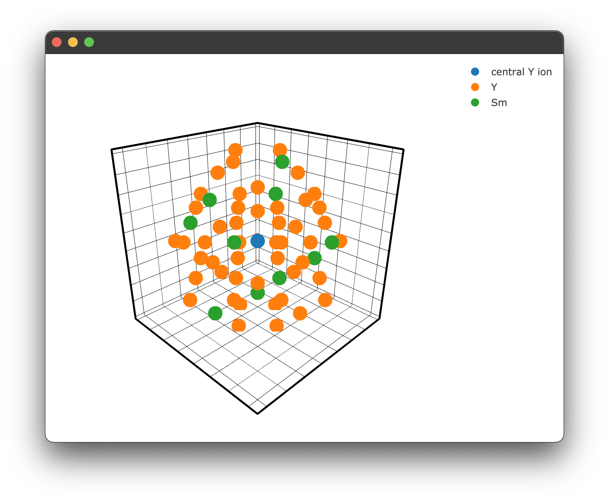

<h1 align="center">PYET-MC</h1>
<p align="center">
  
</p>

<h2 align="center">A library to model energy transfer between lanthanide ions</h2>
<h3 align="center">Get in contact or follow research related to this project</h3>
<p align="center">
    <a href="https://github.com/JaminMartin"></a>
    &nbsp;
    <a href="https://www.linkedin.com/in/jamin-martin-87448a167/"></a>
    &nbsp;
        <a href="https://orcid.org/0000-0002-7204-231X"></a>
    &nbsp;
        <a href="https://www.researchgate.net/profile/Jamin-Martin"></a>
    &nbsp;
</p>

## Table of Contents
- [Introduction](#introduction)
- [Road Map](#road-map)
- [Installation](#installation)
- [Usage](#usage)
  - [Generating a structure & plotting](#generating-a-structure--plotting)
  - [Energy transfer models](#energy-transfer-models)
    - [Modelling energy transfer processes](#modelling-energy-transfer-processes)
    - [A note on caching](#a-note-on-caching)
    - [Adding your own energy transfer model](#adding-your-own-energy-transfer-model)
  - [Fitting experimental data to energy transfer models](#fitting-experimental-data-to-energy-transfer-models)
    - [general fitting](#general-fitting)
    - [weighted fitting examples](#weighted-fitting)
  - [Plotting](#plotting)
    - [Types of plots](#plot-types)
      - [Spectra plots](#spectra-plots)
      - [Transient plots](#transient-plots)
      - [Structure plots](#structure-plots)
    - [Configuring plots](#configuring-plots)
   
    - [Saving plots](#saving-plots)
  - [Troubleshooting](#troubleshooting)
- [Referencing this project](#referencing-this-project)  
- [License](#license)

# Introduction
Collection of tools for modelling the energy transfer processes in lanthanide-doped materials. 

Contains functions for visualising crystal structure around a central donor ion, subroutines for nearest neighbour probabilities and monte-carlo based multi-objective fitting for energy transfer rates. This package aims to streamline the fitting process while providing useful tools to obtain quick structural information. The core function of this library is the ability to simultaneously fit lifetime data for various concentrations to tie down energy transfer rates more accurately. This allows one to decouple certain dataset features, such as signal offset/amplitude, from physical parameters, such as radiative and energy transfer rates. This is all handled by a relatively straightforward API wrapping the Scipy Optimise library. This library is based off the scripts initially written for studying multi-polar interactions between samarium ions in KY<sub>3</sub>F<sub>10</sub> [[1](#1)]
# Road Map 
- ~~Migrate a lot of the plotting functionality to `Plotly` and wrap it in a matplotlib-like GUI. This work has started, an example of this transition can be found [here](#generating-a-structure--plotting) & [here](#fitting-experimental-data-to-energy-transfer-models).~~ ✅ 
- Update structure figures to use Jmol colour palette. Correct atom colours are coming soon!.
- Move compute-heavy / memory-intensive functions to Rust for better performance.
- Add more interaction types e.g., cooperative energy transfer and other more complex energy transfer processes. 
- Add geometric correction factors and shield factors for various crystal structures and ions [[2](#2)]. 
- Add alternative to Monte Carlo methods e.g. the shell model(performance vs accuracy tests required). If successful the shell model could improve performance greatly [[3](#3),[4](#4)].
- Move docs to MDbook for continuous integration.
- Optional open-source database where results can be stored, retrieved, and rated based on data quality and fit, much like the ICCD crystallography database. 
- Add more tests, this will be important as the project grows and other users want to add features. 
# Installation
Currently, pyet is not on the PyPI package repository; this will be the case until this project is more stable. It is still a work in progress. However, if you do wish to use pyet in its current form, it is as simple as the following:

Setup a new Python virtual environment (I recommend Conda) and specify Python 3.11
```
conda create --name 'name of your env' python=3.11
```
Activate this virtual environment with "conda activate 'name of your env'" This ensures the package doesn't overwrite any of your existing Numpy/Scipy python libraries
Clone this repository in a location of your choosing, or download it as a zip file and extract it
```
git clone git@github.com:JaminMartin/pyet-mc.git
```
In the terminal, cd into this directory and tell pip to install this package
```
path/to/my/package/ pip install . 
```
To test that this was successful, create a new Python file (wherever you would like to use pyet, not from within the pyet source code).
Try to import pyet; assuming no error messages appear, pyet has been successfully installed in your virtual environment
```python
from pyet.structure import Structure, Interaction
from pyet.fitting import Optimiser
from pyet.pyet_utils import Trace, cache_reader, cache_list, cache_clear
from pyet.plotting import Plot
```
# Usage 

## Generating a structure & plotting
Firstly, a .cif file must be provided. How you provide this .cif file is up to you! We will take a .cif file from the materials project website for this example. However, they also provide a convenient API that can also be used to provide .cif data. It is highly recommended as it provides additional functionality, such as XRD patterns. Information on how to access this API can be found here https://next-gen.materialsproject.org/api. 
We can create our structure with the following code. However, this may differ if you are using the materials project API. 
```python
KY3F10 = Structure(cif_file= 'KY3F10_mp-2943_conventional_standard.cif')
```
We then need to specify a central ion, to which all subsequent information will be calculated in relation to. 
```python
KY3F10.centre_ion('Y')
```
This will set the central ion to be a Ytrrium ion and yield the following output:
```
central ion is [-5.857692   -5.857692   -2.81691722] Y
with a nearest neighbour Y at 3.9837225383938777 angstroms
```
This gives us the basic information about the host material. 
Now we can request some information! We can now query what ions and how far away they are from that central ion within a given radius. 
This can be done with the following:

```python
KY3F10.nearest_neighbours_info(3.2)
``` 
Output:
```
Nearest neighbours within radius 3.2 Angstroms of a Y ion:
Species = F, r = 2.386628 Angstrom
Species = F, r = 2.227665 Angstrom
Species = F, r = 2.386628 Angstrom
Species = F, r = 2.227665 Angstrom
Species = F, r = 2.386628 Angstrom
Species = F, r = 2.227665 Angstrom
Species = F, r = 2.227665 Angstrom
Species = F, r = 2.386628 Angstrom

```
We can plot this if we would like, but we will increase the radius for illustrative purposes. We can use the inbuilt plotting for this.
```python
if __name__ == "__main__":
  figure = KY3F10.structure_plot(radius = 5)  
  figure.show()  
```
Which yields the following figure:
<p align="center">
 
</p>

Its worth noting here briefly, that due to the way the PyQT5 WebEngine/ App is being rendered using the multiprocessing library it is essential to include the `if __name__ == "__main__":` block. Unfortunately, until a different backend for rendering the `plotly` `.html` files that also supports `javascript` this has to stay.
We can also specify a filter only to show ions we care about. For example, we may only care about the fluoride ions. 
```python
if __name__ == "__main__":
  filtered_ions = ['F, K']

  figure = KY3F10.structure_plot(radius = 5, filter = filtered_ions)  
  figure.show() 
```
This gives us a filtered plot:
<p align="center">
 
</p>


In the future, the colours will be handled based on the ion, much like the materials project, this is a current work in progress. For more general details on how to change these plots please read the documentation regarding configuring plots in pyet-mc [here](#plotting).
## Energy transfer models
The energy transfer process can be modelled for a particular configuration of donor and acceptor ions with the following exponential function 
here $t$ is time, $\gamma_r$ is the radiative decay rate and $\gamma_{tr,j}$ is the energy transfer rate for this confuration. Assuming a single-step multipole-multipole interaction (currently, the only model implemented), $\gamma_{tr,j}$ may be modelled as a sum over the transfer rates to all acceptors $\gamma_{tr,j}$ takes the form: 

$$\gamma_{tr,j} = C_{cr} \sum_i \left(\frac{R_0}{R_i}\right)^s$$
$I_j(t) = e^{-(\gamma_r + \gamma_{tr,j})t}$
Here $R_i$ is the distance between donor and acceptor, $C_{cr}$ is the energy-transfer rate to an acceptor at $R_0$ the nearest-neighbour distance, and $s$ depends on the type of multipole-multipole interaction ($s$ = 6, 8, 10 for dipole-dipole, dipole-quadrupole and quadrupole-quadrupole interactions respectively). The term $\sum_i \left(\frac{R_0}{R_i}\right)^s$ forms the basis of our Monte Carlo simulation; we will refer to this as our interaction component. The lifetime for an ensemble of donors can be modelled by averaging over many possible configurations of donors and acceptors:

$$I(t) =\frac{1}{n} \sum_{j=1}^n  e^{-(\gamma_{r} + \gamma_{tr,j})t}$$

Where $n$ is the number of unique random configurations. We can also define an average energy transfer rate $\gamma_{av}$ defined as:
$$\frac{1}{n}\sum_{j=1}^n \gamma_{tr,j}$$
This is a useful value for comparing hosts at a similar concentration. 

### Modelling energy transfer processes
Note: Currently, there is only one energy transfer process implemented so this section may be subject to change in future releases. 

Consider the crystal structure we previously generated. We wish to "dope" that structure with some lanthanide ions randomly around some central donor ion. We will replace our previously defined "central yttrium atom" with a samarium. We will then randomly (based on the concentration of the dopant in the crystal) dope samarium ions around this central samarium ion. This step needs to be performed many times to "build up" many random unique samarium-samarium donor-acceptor configurations. When the number of random configurations is large enough, this should accurately represent a physical crystal sample. This is the Monte-Carlo aspect of our energy transfer analysis. 

To generate our random samples, we utilise the interaction class. This class takes in our structure class and provides additional methods for calculating our interaction components and more specific plotting methods for doped crystals. We can enact this class simply by passing our structure to the interaction class:
```python
crystal_interaction = Interaction(KY3F10)
```

```python
coords = crystal_interaction.distance_sim(radius=10, concentration = 15, dopant='Sm')
```
This returns a list of radial distances in angstroms of the dopant samarium ions about the central samarium donor ion.
```
[8.28402747 7.17592429 7.17592429 9.33368811 8.28402747 4.30030493
 8.28402747 7.17592429 9.33368811 7.17592429 3.98372254 8.28402747]
```

We can also take a more detailed look at what has happened by calling 
```python
print(coords.filtered_coords)
```
```
           r       theta           phi species
0   7.175924  115.071364 -1.156825e+02       Y
1   7.175924  115.071364 -1.543175e+02       Y
2   8.284027   90.000000 -1.350000e+02       Y
3   7.175924   66.886668 -1.525658e+02       Y
4   7.175924   66.886668 -1.174342e+02       Y
5   9.192125  109.317471 -1.800000e+02       Y
6   5.861968   92.188550 -1.800000e+02       Y
7   9.333688  162.434187 -1.800000e+02       Y
8   8.284027  135.000000  1.800000e+02      Sm
9   7.175924  115.071364  1.156825e+02      Sm
10  7.175924  115.071364  1.543175e+02       Y
11  4.300305  135.000000 -1.800000e+02       Y
12  3.983723   45.000000 -1.800000e+02       Y
13  7.175924   66.886668  1.525658e+02      Sm
14  9.333688   72.434187 -1.800000e+02      Sm
15  8.284027   45.000000 -1.800000e+02       Y
16  9.192125   19.317471 -1.800000e+02       Y
17  8.284027   90.000000  1.350000e+02       Y
18  7.175924   66.886668  1.174342e+02       Y
19  9.192125  109.317471 -9.000000e+01       Y
20  5.861968   92.188550 -9.000000e+01       Y
```
As we can see, some of the yttrium ions have been replaced by samarium ions, as expected. 
We can also plot this to visually see what is happening; the interaction class has similar plotting functionality. 
```python
if __name__ == "__main__":
  figure = crystal_interaction.doped_structure_plot(radius=10.0, concentration = 15.0 , dopant = 'Sm' , filter = ['Y','Sm'])
  figure.show()
```

yeilding the following figure:
<p align="center">
 
</p>

We can now calculate our interaction component for each random doping configuration. This is handled by the sim method, which currently is referred to as sim_single_cross as it is the only implemented method at the time of writing. However, it is possible to add your own by wrapping 'distance_method' described above for cooperative processes, for example. 

```python
interaction_components2pt5pct = crystal_interaction.sim_single_cross(radius=10, concentration = 2.5, interaction_type='DQ', iterations=20)
```
The sim method takes a radius, concentration, interaction type and number of iterations. The interaction type is given by a two-letter code, i.e. 'DQ' equals dipole-quadrupole. 
We will need more iterations than just 20 for fitting, closer to 50,0000. If we rerun this now with 50,0000 iterations, we get the following response:
```
file found in cache, returning interaction components
```
This is because I have already run this command, which has been cached. See the notes on caching [here](#a-note-on-caching).
The sim returns a Numpy array of interaction components that matches the number of iterations and will be utilised in our fitting process next! 

We can then generate another set of interaction components for a 5% doped sample simply by changing the concentration
```python
interaction_components5pct = crystal_interaction.sim_single_cross(radius=10, concentration = 5, interaction_type='DQ', iterations=50000)
```
The crystal interaction simulation can also also accept the boolean flag `intrinsic = True`, this uses a modified formulation of the interaction components in the form $$\gamma_{tr,j} = C_{cr} \sum_i \left(\frac{1}{R_i}\right)^s.$$

This gives us the energy transfer rate ($C_{cr}$) or average energy transfer rate ($\gamma_{av}$) in terms of a dopant ion 1 &#8491; from the donor ion. The relevance of this is for work regarding an intrinstic energy rate. It is set to false by default as it is not as relevant at this stage; however, in future it may be of interest. 

### Adding your own interaction model
Adding your own model should be relatively straight forward. 
In the above code, we call the: `.sim_single_cross` method. You can add a different interaction method simply by defining a new function that can inherit the properties of the `Interaction` class e.g. 

```python
def sim_cooperative_energy_transfer(self, arg1, arg2, argn):
    # your code here

crystal_interaction = Interaction(KY3F10) # as shown before 
crystal_interaction.sim_cooperative_energy_transfer = sim_cooperative_energy_transfer
```

We can then use this method as the above default example.

### A note on caching
As these calculations can be quite time-consuming for large iterations, and for said large iterations, the difference between runs should be minimal, caching was implemented to speed up subsequent runs.

When first used, pyet will create a cache directory. All interaction simulations will cache their interaction components along with info regarding the simulation conditions in JSON format. The generated JSON file is named in the following convention:

```
process_radius_concentration_interactiontype_iterations_intrinsic.json
```
Resulting in a file name: 
```
singlecross_20_2pt5_DQ_50000_intrinsic_False
```
We can query and return the interaction components of the JSON file with the following code:
```python
from pyet.pyet_utils import cache_reader, cache_clear, cache_list

interaction_components2pt5pct = cache_reader(process = 'singlecross', radius = 10 , concentration = 2.5 , iterations = 50000 , interaction_type = 'DQ', intrinsic = False)
interaction_components5pct =  cache_reader(process = 'singlecross', radius = 10 , concentration = 5 , iterations = 50000 , interaction_type = 'DQ', intrinsic = False)
```
If what you have specified is not found in the cache, there will be a console log such as this:
```
File not found, check your inputs or consider running a simulation with these parameters
```
This will also return a None type, which must be handled accordingly, such as using a Python match statement. However, most likely you won't run into this as the `Interaction..sim_single_cross()` method implements this before it runs anyway. If the query does return, it will return a Numpy array of our interaction components. In that case, the following is also displayed:

```
file found in cache, returning interaction components
```
Following a major update to pyet-mc, it is also recommended that you clear the cache in the event a bug is discovered in the existing code. This will be highlighted in any release notes.

This can be done using:
```python
cache_clear()
```
This will prompt you if you are sure you would like to delete the cache.
```
Are you sure you want to delete all the cache files? [Y/N]?
```
You can also specify a file of a given simulation configuration, as was done above. In the event, you may have made a mistake and forgot to change a .cif file etc. It happens to the best of us...

If you want to know the status of your cache, you can also use the cache list to get the details, including file names and sizes. Like cache_clear(), a simple command is all you need!

```python
cache_list()
```
```
#======# Cached Files #======#
singlecross_10_2pt5_DQ_50000.json (958053 bytes)
singlecross_10_5_DQ_50000.json (1121375 bytes)
Total cache size: 2.08 MB
Run "cache_clear()" to clear the cache
#============================#
```


## Fitting experimental data to energy transfer models
Fitting experimental lifetime transients to determine energy transfer parameters is the primary purpose of this library, and so it will utilise all the previous components covered. Its core function is to allow for the simultanous fitting for multiple concentrations of crystals therefore tightly constraining the energy transfer and radiative decay rates.

### General fitting
Recalling our two dipole-quadrupole datasets previously for 2.5% and 5% doping, respectively, If you do not have these generated interaction components, please refer to [modelling energy transfer processes](#modelling-energy-transfer-processes). We can use them to generate some artificial data given some additional parameters. 
For this particular model, we must provide it with four additional parameters: an amplitude, cross-relaxation rate ($C_{cr}$), a radiative decay rate, and horizontal offset. 

```python
#specify additional constants (the time based constants are in ms^-1)
const_dict1  = {'amplitude': 1 , 'energy_transfer': 500, 'radiative_decay' : 0.144, 'offset':0}
const_dict2  = {'amplitude': 1 , 'energy_transfer': 500, 'radiative_decay' : 0.144, 'offset': 0}
```
Note the units used here, the energy transfer and radiative rates are given in  $\text{ms}^{-1}$, it is more common to have these in $\text{s}^{-1}$, however here we are using $\text{ms}^{-1}$ for the purpose of generating data with a nice time scale.
Now we can generate some synthetic data and plot it:

```python
if __name__ == "__main__":
    from pyet.fitting import general_energy_transfer
    # generate some random data
    time = np.arange(0,21,0.02) #1050 data points 0 to 21ms
    #Generate some random data based on our provided constants and time basis
    data_2pt5pct = general_energy_transfer(time, interaction_components2pt5pct, const_dict1)
    data_5pct = general_energy_transfer(time, interaction_components5pct, const_dict2)
    #Add some noise to make it more realistic
    rng = np.random.default_rng()
    noise = 0.01 * rng.normal(size=x.size)
    data_2pt5pct = data_2pt5pct + y_noise
    data_5pct = data_5pct + y_noise

    #Plotting
    fig2 = Plot()
    fig2.transient(data_2pt5pct)
    fig2.transient(data_5pct)
    fig2.show()
```


which gives the following result: 
<p align="center">

</p>

as we would expect! To see more details on how plotting and the `Plot.transient()` method works please see the [plotting](#plotting) documentation.

We can attempt to fit the parameters initially used to generate this data. Pyet provides a wrapper around the scipy.optimise library to simultaneously fit multiple data traces that _should_ have the same physical parameters, e.g. our radiative cross-relaxation rates, while allowing our offset and amplitude to vary independently. 

We must first specify our independent and dependent parameters. We can achieve this by giving our variables either different (independent variables) or the same name (dependent variables)
```python
params2pt5pct = ['amp1', 'cr', 'rad', 'offset1']
params5pct = ['amp2', 'cr', 'rad', 'offset2']
```
We then construct a trace object that takes our experimental data (e.g. signal, time), a label, and our interaction components 
```python
trace2pt5pct = Trace(data_2pt5pct, time,  '2.5%', interaction_components2pt5pct)
trace5pct = Trace(data_5pct, time, '5%', interaction_components5pct)
```
These objects and our list of variables can be passed to the optimiser for fitting. 
```python
opti = Optimiser([trace2pt5pct,trace5pct],[params2pt5pct,params5pct], model = 'default')
```
We choose the default model, which is our energy transfer model discussed above, and is the same model we used to generate the synthesic data. Note: This model can be supplemented with your own energy transfer model if it differs from the default model. 
We then give our model a guess. This can be inferred by inspecting the data or being very patient with the fitting / choice of the optimiser. 
```python
guess = {'amp1': 1, 'amp2': 1, 'cr': 100,'rad' : 0.500, 'offset1': 0 , 'offset2': 0}
```
As you can see, we only need to specify the unique set of parameters, in this case, six rather than eight total parameters. This will force the fitting to use the same cross-relaxation and radiative rates for both traces. This is what we would expect to be the case physically. The concentration dependence is handled by our interaction components. In a real experimental situation, you may only be able to have these parameters coupled if there is uncertainty in your actual concentrations. If your cross-relaxation parameters vary greatly, this is a good indication your concentrations used to calculate the interaction components are off. 

Regardless, we can finally attempt to fit the data. We tell our optimiser to fit and give it one of the `scipy.optimise` methods and any other keywords, e.g. bounds or tolerance. In future, I hope to simplify this to be able to use `scipy.optimise.least_squares` and the `scipy.optimise` global fitting methods to add more options for the fitting process.
```python
res = opti.fit(guess, method = 'Nelder-Mead', tol = 1e-13)
```
This will return a dictionary of fitted parameters:
```
resulting fitted params:{'amp1': 0.9969421233991949, 'amp2': 0.9974422375924311, 'cr': 497.555275, 'rad': 0.146633387615, 'offset1': 0.0013088082858218686, 'offset2': 0.00020609427517915668}
```
Which is close to our given parameters and can be used to plot our final fitted results! There will also be some additional outputs regarding weightings, which is discussed [here](#weighted-fitting).

```python
if __name__ == "__main__":
    fig = Plot()
    fig.transient(data_2pt5pct)
    fig.transient(data_5pct)
    #generate the data to show the fitted results 
    rdict = res.x
    
    fit1 = general_energy_transfer(x, interact1, {'a': rdict['amp1'], 'b': rdict['cr'], 'c': rdict['rad'],'d': rdict['offset1']})
    fit2 = general_energy_transfer(x, interact2, {'a': rdict['amp2'], 'b': rdict['cr'], 'c': rdict['rad'], 'd': rdict['offset2']})
    fig.transient(time,fit1, fit=True, name = 'fit 2.5%')
    fig.transient(time,fit2, fit = True, name = 'fit 5%')
    fig.show()
```
Note, the `transient()` method can take either a `Trace` or `x, y` data. the option `fit = True` will display the data in line mode rather than markers. 
<p align="center">
 
</p>

### Weighted fitting
There is also the ability to have the fitting process weight each trace differently, as well as adjust the weigthing of all traces when their length is not even. Take for example, the case where we have two traces of different length. We can generate this as before with some slight modifications.

```python
if __name__ == "__main__":
    from pyet.fitting import general_energy_transfer
    # generate some random data
    time_1050 = np.arange(0,21,0.02) #1050 data points 0 to 21ms
    time_525 = np.arange(0,21,0.04) #525 data points 0 to 21ms
    #Generate some random data based on our provided constants and time basis
    data_2pt5pct = general_energy_transfer(time_1050, interaction_components2pt5pct, const_dict1)
    data_5pct = general_energy_transfer(time_525, interaction_components5pct, const_dict2)
    #Add some noise to make it more realistic
    rng = np.random.default_rng()
    noise_1050 = 0.01 * rng.normal(size=time_1050.size)
    noise_525 = 0.01 * rng.normal(size=time_525.size)
    data_2pt5pct = data_2pt5pct + y_noise
    data_5pct = data_5pct + y_noise
```
This is much the same as before but now we have two datasets of different lengths. If we try to fit this by trying to minimise the Residual Sum of Squares (RSS) (which this library uses) the fit would be intrinsicly biased to the dataset of longer length. We could instead use the Mean Squared Error (MSE) to account for this, but MSE is subject to biasing from outlier data. Instead, we add an appropriate weighting to the smaller datasets to that their contribution is proportional to that of the longer dataset. This method requires the assumption all data sets have a similar variance, which is fair for these kinds of measurements with good signal quality and high numbers of averages. This gives us a Weighted Residual Sum of Squares (WRSS) implementation. This re-weighting of data is implemented as a default method in the fitting optimiser class. So if we re-ran the fit with this new dataset we would see this output during the fit:

```
the weights of the 2.5% trace has been adjusted to 1.0
the weights of the 5% trace has been adjusted to 2.0
['amp1', 'amp2', 'cr', 'rad', 'offset1', 'offset2']
Guess with initial params:{'amp1': 1, 'amp2': 1, 'cr': 100, 'rad': 0.5, 'offset1': 0, 'offset2': 0}
Started fitting...
```

This aims to compensate for the discrepancy in the number of data points. However it can be turned off if it is not a desired feature simply by changing the instantiation of the optimiser to have `auto_weighting` set to `False`. 
```python
opti = Optimiser([trace2pt5pct,trace5pct],[params2pt5pct,params5pct], model = 'default', auto_weights = False)
```

There is also the ability to set a per-trace weighting to each `Trace` so that it intentionally biases the fitting process to try to either fit more or less to that data set. This is useful in the case where we have less than ideal data that we dont want to influence the fit or in the case we have ideal data that we want to fit more heavily to. To add a weighting factor to a trace it is as simple as declaring that when we create our `Trace` objects. Lets imagine the case where we want to weight our smaller dataset further for some contrived reason. We can simply add a weighting to that `Trace`. Note that by default the weighting is set to one. 
```python
trace2pt5pct = Trace(data_2pt5pct, time,  '2.5%', interaction_components2pt5pct)
trace5pct = Trace(data_5pct, time, '5%', interaction_components5pct, weighting = 5)
```

This would yield the following when fitting:

```
the weights of the 2.5% trace have been adjusted to 1.0
the weights of the 5% trace have been adjusted to 10.0
['amp1', 'amp2', 'cr', 'rad', 'offset1', 'offset2']
Guess with initial params:{'amp1': 1, 'amp2': 1, 'cr': 100, 'rad': 0.5, 'offset1': 0, 'offset2': 0}
Started fitting..
```
As you can see, the weighting has actually been adjusted to 10; this is due to the automatic re-weighting ensuring the weighting we provide is a weighting for _equal_ datasets. If you don't want to use the automatic re-weighting but restain your weighting of `5` you can simply turn off automatic re-weighting as discussed.

There is no right or wrong way to implement these weights, and should be addressed on a case-by-case basis, as they can heavily influence your fitted parameters.

## Plotting
The pyet-mc library comes with a built-in plotting library that 1. Provides a matplotlib style plotting wrapper for `Plotly`. It achieves this by rendering `Plotly`'s `html + js` figures in a `Qt5 WebEngine` in a separate Python process. 
It also provides sensible defaults for plotting the spectra, lifetimes and crystal structures that may be of use to people not taking advantage of the fitting functionality of this library. Lastly, it features a unique plotting configuration method to make your code more readable at more readily checked between peers without clutter associated with plotting configuration.
### Plot types
Currently there are three implemented plotting types. They are `spectra`, `transient` and `structure_3d` which are wrappers for `Plotly`'s  `go.Scatter()` and `go.Scatter3d` respectively. Where `transient` is specifically used for plotting lifetime data on a logscale. 
#### Spectra plots
A spectra plot is a simple `x,y` plot of spectroscopic data with sensible defaults. It will for example, automatically find an appropriate major and minor tick spacing. It defaults to using wavenumbers as the `x` axis as that is what we commonly use in our research group. This can be easily overridden, however (see [configuring plots](#configuring-plots)) the goal is to be able to produce fast plots of spectra with sensible defaults that can be stylized to your tastes after. 
We can create a spectra plot simply with this code:
```python
from pyet.plotting import Plot
from pyet.pyet_utils import random_spectra
if __name__ == "__main__":
    wavelengths = np.arange(400,450, 0.1) #generate some values between 400 and 450 nm
    wavenumbers, signal = random_spectra(wavelengths, wavenumbers=True)
    figure = Plot()
    figure.spectra(x, y, name = 'an example') #give the data a name for the legend
    figure.show()
```

which gives us the following figure:

<p align="center">
 
</p>

#### Transient plots
The figures plotted using the `transient` plot type have been shown extensively in the section on [fitting](#fitting-experimental-data-to-energy-transfer-models) however it is worth discussing the purpose and limitations of this plot type.

The goal of this plot type is to quickly plot transients on an appropriate log scale for easy interpretation. It does however have its limitations. Currently in order to display the `y-axis` ticks and minor ticks correctly it assumes your data (or more likely your fit) is normalised to 1. It then plots ~3 orders of magnitude on the `y-axis` and the `x-axis` limits are set from zero to the maximum value of your data. The `x-axis` label default is milliseconds however, as was the case for the spectra plot this can be easily [reconfigured](#configuring-plots) to an appropriate time base.

The `transient` plot type is designed to handel either `x,y` data as might be returned from the fitting process for example or it can take a `Trace`. This was to minimise code / data duplication. If you have defined a `Trace` for your data and given it a name, you can pass this in directly without having to worry about providng any `y` values. 
#### Structure plots
The structure plots use Ploty's `go.Scatter3d` as their base. Unlike the previous two plot types the structure plotting is handled by the `structure3d` plotting method which is in turn wrapped by the `Structure` and `Interaction` plotting methods. These two methods leverage `structure3d` and its defaults to produce the structure plots we have seen earlier. It is however possible to bypass those structure plots if you dont have a `.cif` file or you want to write your own more general 3D plot. 

To create a 3D plot without using a `.cif` file and `Structure.structure_plot()` or `Interaction.doped_structure_plot()` we simply need to use the methods we used for the `spectra` & `transient` plot types:

```python
figure = Plot()

figure.structure_3d([0,1,2],[0,5,2],[0,1,5], name = 'Si')
figure.structure_3d([5,1,1],[2,0,1],[2,2,1], name='Y')
figure.show()
```
which gives us the following figure:

<p align="center">
 
</p>

### Configuring plots

There are a few ways to change the configuration of plots in `pyet-mc`. The most straight forward one is to directly pass layout arguments when creating our plot type. These layout arguments are just standard `Plotly` arguments and you can refer to their documentation for a full list of them. However I shall show a few common examples. 

The obvious one would be that the automatic `x-axis` range calculation of `pyet-mc` might not be quite what you want it to be. This can be easily changed by overwriting the defaults as we just discussed. 
```python
wavelengths = np.arange(400,450, 0.1) #generate some values between 400 and 450 nm
wavenumbers, signal = random_spectra(wavelengths, wavenumbers=True)
x_range = [23000,23500]
ticks = 50
figure = Plot(xaxis={'range': x_range,'dtick': 100})
figure.spectra(wavenumbers, signal, name = 'an example') #give the data a name for the legend
figure.show()
```

<p align="center">
 
</p>

It is also easy to update the style of the data on the plot using a similar method:

```
wavelengths = np.arange(400,450, 0.1) #generate some values between 400 and 450 nm
wavenumbers, signal = random_spectra(wavelengths, wavenumbers=True)
x_range = [23000,23500]
ticks = 50
figure = Plot(xaxis={'range': x_range,'dtick': 100,})
figure.spectra(wavenumbers, signal, name='an example', mode='markers', marker={'color': 'red'}) 
figure.show()

```

<p align="center">
 
</p>

While it is quite easy to specify a marker mode or colour for each dataset on a plot inline like the examples above, it becomes quite obtuse to do this for the plot layout configuration as there are far more options. This is greatly exemplified when you have multiple Python files plotting different sets of data but you want them to all have the same formatting, say for a thesis or publication. In `pyet-mc` a configuration method was introduced to simplify the layout configuration of `Plotly` plots.  This is where all the default plot layouts are configured and, therefore arent hard-coded into the plotting functionality directly. When the plotting library is loaded it also loads this config file. Any arguments passed to the `Plot()` class overwrite it. However, it also means you can just directly modify this file and all your plots will be created with this layout by default!

The config file is a simple `.toml` file type, 
the general layout of the `plotting_congfig.toml` file is:
```toml
[spectra_layout]
  title_text = ""
  showlegend = true
  title = ''
  margin = { l = 50, r = 50, t = 20, b = 70 }
  paper_bgcolor = "white"

  [spectra_layout.font]
    family = 'Times New Roman, monospace'
    size = 20
    color = 'black'

  [spectra_layout.xaxis]
    title = 'Wavenumber (cm<sup>-1</sup>)'
    exponentformat = 'none'
    showgrid = false
    showline = true
    tickmode = 'linear'
    ticks = 'outside'
    showticklabels = true
    linewidth = 4
    linecolor = 'black'
    ticklen = 15
    tickwidth = 4
    tickcolor = 'black'


    ...
```
where each of the three currently available plotting types has their layouts configured here. A full example of this file can be found in the `src/pyet/plotting_config/` directory of the package on `Github` or wherever your Python package manager installed the library. You can directly edit the file there one the package has been installed. This is not the recomended way to provide a user-configured config file as it runs the risk of completely breaking the functionality of the library if you misconfigure it with no ability to fall back (unless of course you make a copy of the file or re-download it from this repo). Instead, you can use a `pyet-utils` function called `load_local_config` to load a local configuration from a specified directory. In this example we will change the `x-axis` colour scheme to red in our local config file. 

```toml
[spectra_layout]
  title_text = ""
  showlegend = true
  title = ''
  margin = { l = 50, r = 50, t = 20, b = 70 }
  paper_bgcolor = "white"

  [spectra_layout.font]
    family = 'Times New Roman, monospace'
    size = 20
    color = 'black'

  [spectra_layout.xaxis]
    title = 'Wavenumber (cm<sup>-1</sup>)'
    exponentformat = 'none'
    showgrid = false
    showline = true
    tickmode = 'linear'
    ticks = 'outside'
    dtick = 50
    showticklabels = true
    linewidth = 4
    linecolor = 'red'
    ticklen = 15
    tickwidth = 4
    tickcolor = 'red'
    
    [spectra_layout.xaxis.minor]
      ticks = 'outside'
      ticklen = 7
      showgrid = false

    [spectra_layout.xaxis.tickfont]
      family = 'Times new roman, monospace'
      size = 20
      color = 'red'

    [spectra_layout.xaxis.titlefont]
      family = 'Times new roman, monospace'
      size = 20
      color = 'red'
```
By simply adding the `load_local_config` function we can update our plots:

```python
load_local_config('/path/to/your/local_plotting_config.toml')
figure = Plot()
figure1.spectra(wavenumbers, signal, name='an example') 
figure.show()
```
<p align="center">
 
</p>

easy as that!

This can be done for all three plot types. A complete list of optional layout features can be found in `Ploty's` documentation for the parent plot type of the three plots currently implemented in this library. 

### Saving plots 
Under the hood, pyet-mc's plotting library leverages `Plotly`'s saving method, therefore it is very simple to save a figure.
We provide a save path and file name with the appropriate file extension (e.g. `.svg`, `.pdf` for a full list consult the `Plotly` documentation [here](https://plotly.com/python/static-image-export/))
```python
path = '/path/to/store/'
name = 'file.svg'
figure.save(path, name)
```
If any errors arise from the plotting, it is again best to consult the `Plotly` documentation regarding [saving figures](https://plotly.com/python/static-image-export/), as it may require installing the `kaleido` package seperately from the 
# Troubleshooting
- pyet is using too much memory:
  - this is a known issue. Numpy does not seem to free up its arrays fast enough, so it can consume a lot of memory. For example, a 50,000 iteration interaction component and 15,000 time points will consume 6GB of memory. This is why this library does not use pre-allocation, as it is too easy to accidentally run out of memory and use swap memory, slowing things down further. I have a Rust implementation that does not suffer from this issue due to better memory management; This will be part of future releases.
- pyet is slow:
  - this is also a known issue. This boils down to the number of exponential calls. This is documented here: https://github.com/JaminMartin/pyet-mc/issues/2

- pyet does not converge to a good fit
  -  This could be for a multitude of reasons. The most probable is either the tolerance for the fit or the fitting algorithm. Try decreasing your tolerance and trying some different methods. Global optimise will soon be available to help remedy the need for good initial guesses. The concentration specified for the interaction component may not be accurate; this, alongside the cross-relaxation parameter being coupled to all traces, may cause an inability to converge. Try to fit with them uncoupled. 

# Referencing this project
To reference this project, you can use the citation tool in the About info of this repository. Details can also be found in the .cff file in the source code. 
# License
The project is licensed under the GNU GENERAL PUBLIC LICENSE.
# References
<a id="1">[1]</a> 
J.L.B. Martin, M.F. Reid, and J-P.R. Wells. Dipole–Quadrupole interactions between Sm<sup>3+</sup> ions in KY<sub>3</sub>F<sub>10</sub> nanocrystals. _Journal of Alloys and Compounds_ (2023).

<a id="2">[2]</a> 
 T. Luxbacher, H.P. Fritzer, J.P. Riehl, C.D. Flint. The angular dependence of the multipole–multipole interaction for energy transfer. _Theoretical Chemistry Accounts_ (1999).

<a id="3">[3]</a> 
 T. Luxbacher, H.P. Fritzer, C.D. Flint.  Competitive cross-relaxation and energy transfer within the shell model: The case of Cs<sub>2</sub>NaSm<sub>x</sub>Eu<sub>y</sub>Y<sub>1-x-y</sub>Cl<sub>6</sub>. _Journal of Luminescence_ (1997).


<a id="4">[4]</a> 
 T. Luxbacher, H.P. Fritzer, C.D. Flint. Competitive cross-relaxation and energy transfer in Cs<sub>2</sub>NaSm<sub>x</sub>Eu<subv>v</sub>Gd<sub>1-x-v</sub>Cl<sub>6</sub>. _Tunable Solid State Lasers_ (1997).


<a id="5">[5]</a> 