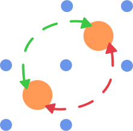

<h1 align="center">PYET-MC</h1>

  

<h2 align="center">A library to model energy transfer between lanthanide ions</h2>
<h3 align="center">Get in contact or follow research related to this project</h3>

    
    &nbsp;
    
    &nbsp;
        
    &nbsp;
        
    &nbsp;

