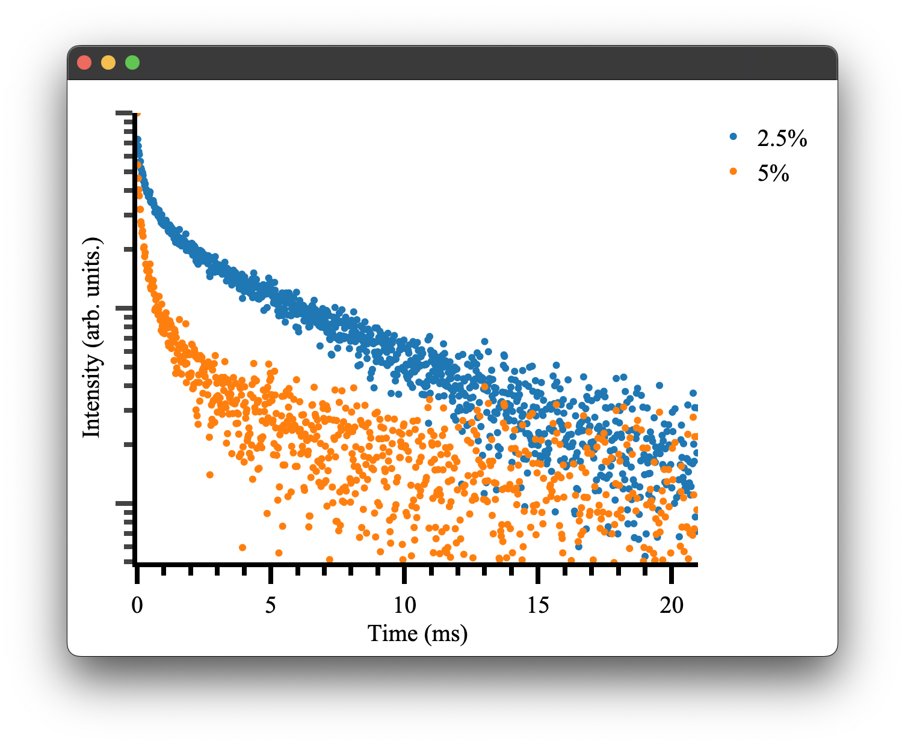
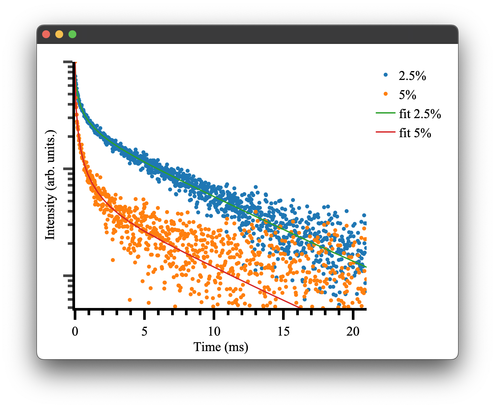

# General Fitting
Recalling our two dipole-quadrupole datasets previously for 2.5% and 5% doping, respectively, If you do not have these generated interaction components, please refer to [modelling energy transfer processes](../structures/modelling_energy_transfer.md#modelling-energy-transfer-processes). We can use them to generate some artificial data given some additional parameters. 
For this particular model, we must provide it with four additional parameters: an amplitude, cross-relaxation rate ($C_{cr}$), a radiative decay rate, and horizontal offset. 

```python
#specify additional constants (the time based constants are in ms^-1)
const_dict1  = {'amplitude': 1 , 'energy_transfer': 500, 'radiative_decay' : 0.144, 'offset':0}
const_dict2  = {'amplitude': 1 , 'energy_transfer': 500, 'radiative_decay' : 0.144, 'offset': 0}
```
Note the units used here, the energy transfer and radiative rates are given in  $\text{ms}^{-1}$, it is more common to have these in $\text{s}^{-1}$, however here we are using $\text{ms}^{-1}$ for the purpose of generating data with a nice time scale.
Now we can generate some synthetic data and plot it:

```python
if __name__ == "__main__":
    # generate some random data
    time = np.arange(0,21,0.02) #1050 data points 0 to 21ms
    #Generate some random data based on our provided constants and time basis
    data_2pt5pct = general_energy_transfer(time, interaction_components2pt5pct, const_dict1)
    data_5pct = general_energy_transfer(time, interaction_components5pct, const_dict2)
    #Add some noise to make it more realistic
    rng = np.random.default_rng()
    noise = 0.01 * rng.normal(size=time.size)
    data_2pt5pct = data_2pt5pct + noise
    data_5pct = data_5pct + noise

    #Plotting
    fig4 = Plot()
    fig4.transient(time, data_2pt5pct)
    fig4.transient(time, data_5pct)
    fig4.show()

```


which gives the following result: 
<p align="center">

</p>

as we would expect! To see more details on how plotting and the `Plot.transient()` method works please see the [plotting](#plotting) documentation.

We can attempt to fit the parameters initially used to generate this data. Pyet provides a wrapper around the scipy.optimise library to simultaneously fit multiple data traces that _should_ have the same physical parameters, e.g. our radiative cross-relaxation rates while allowing our offset and amplitude to vary independently. 

We must first specify our independent and dependent parameters. We can achieve this by giving our variables either different (independent variables) or the same name (dependent variables)
```python
params2pt5pct = ['amp1', 'cr', 'rad', 'offset1']
params5pct = ['amp2', 'cr', 'rad', 'offset2']
```
We then construct a trace object that takes our experimental data (e.g. signal, time), a label, and our interaction components 
```python
trace2pt5pct = Trace(data_2pt5pct, time,  '2.5%', interaction_components2pt5pct)
trace5pct = Trace(data_5pct, time, '5%', interaction_components5pct)
```
These objects and our list of variables can be passed to the optimiser for fitting. 
```python
opti = Optimiser([trace2pt5pct,trace5pct],[params2pt5pct,params5pct], model = 'default')
```
We choose the default model, which is our energy transfer model discussed above, and is the same model we used to generate the synthetic data. Note: This model can be supplemented with your own energy transfer model if it differs from the default model. 
We then give our model a guess. This can be inferred by inspecting the data or being very patient with the fitting / choice of the optimiser. 
```python
guess = {'amp1': 1, 'amp2': 1, 'cr': 100,'rad' : 0.500, 'offset1': 0 , 'offset2': 0}
```
As you can see, we only need to specify the unique set of parameters, in this case, six rather than eight total parameters. This will force the fitting to use the same cross-relaxation and radiative rates for both traces. This is what we would expect to be the case physically. The concentration dependence is handled by our interaction components. In a real experimental situation, you may only be able to have these parameters coupled if there is uncertainty in your actual concentrations. If your cross-relaxation parameters vary greatly, this is a good indication your concentrations used to calculate the interaction components are off. 

Regardless, we can finally attempt to fit the data. We tell our optimiser to fit and give it one of the `scipy.optimise` methods and any other keywords, e.g. bounds or tolerance. The methods available all of those provided by `scipy.optimise` as well as `dual-annealing`, `basinhoping` and `differential evolution`. Details of their use can be found here [here](fitting_algorithms.md#solvers)

```python
res = opti.fit(guess, method = 'Nelder-Mead', tol = 1e-13)
```
This will return a dictionary of fitted parameters:
```
resulting fitted params:{'amp1': 0.9969421233991949, 'amp2': 0.9974422375924311, 'cr': 497.555275, 'rad': 0.146633387615, 'offset1': 0.0013088082858218686, 'offset2': 0.00020609427517915668}
```
Which is close to our given parameters and can be used to plot our final fitted results! There will also be some additional outputs regarding weightings, which is discussed [here](weighted_fitting.md).

```python
if __name__ == "__main__":
    fig5 = Plot()
    fig5.transient(trace2pt5pct)
    fig5.transient(trace5pct)
    #generate the data to show the fitted results 
    rdict = res.x #the dictionary within the result of the optimiser
    
    fit1 = general_energy_transfer(time, interaction_components2pt5pct, {'a': rdict['amp1'], 'b': rdict['cr'], 'c': rdict['rad'],'d': rdict['offset1']})
    fit2 = general_energy_transfer(time, interaction_components5pct, {'a': rdict['amp2'], 'b': rdict['cr'], 'c': rdict['rad'], 'd': rdict['offset2']})
    fig5.transient(time,fit1, fit=True, name = 'fit 2.5%')
    fig5.transient(time,fit2, fit = True, name = 'fit 5%')
    fig5.show()
```
Note the `transient()` method can take either a `Trace` or `x, y` data. the option `fit = True` will display the data in line mode rather than markers. 
<p align="center">
 
</p>