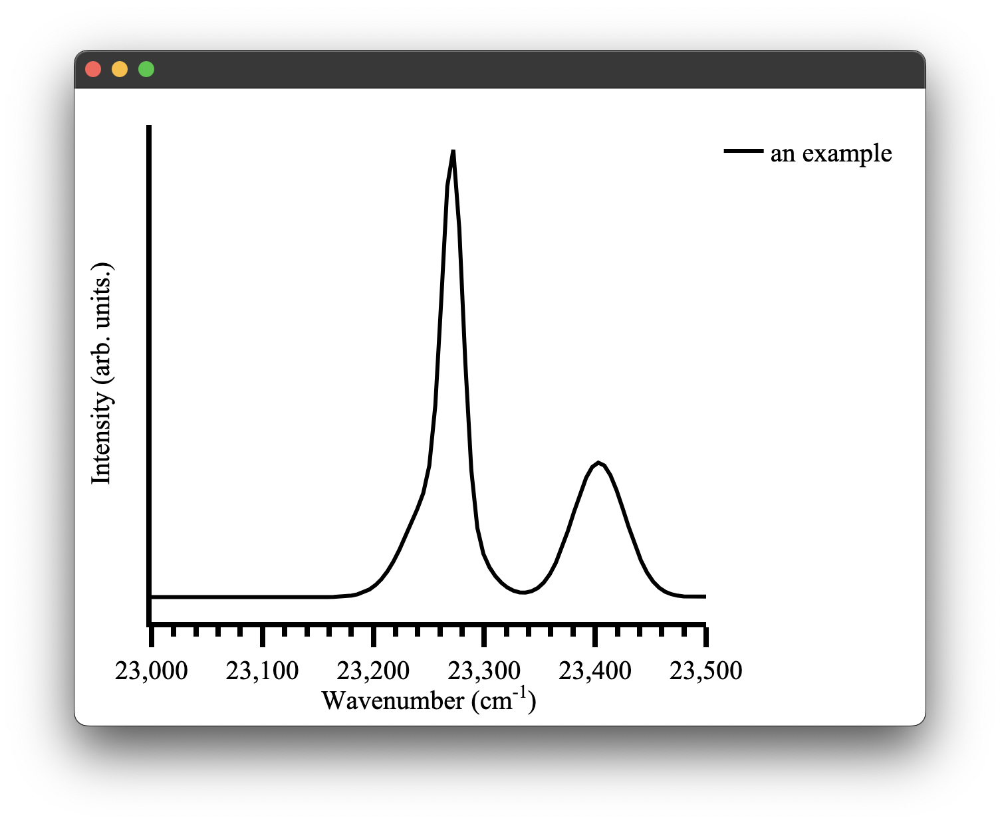
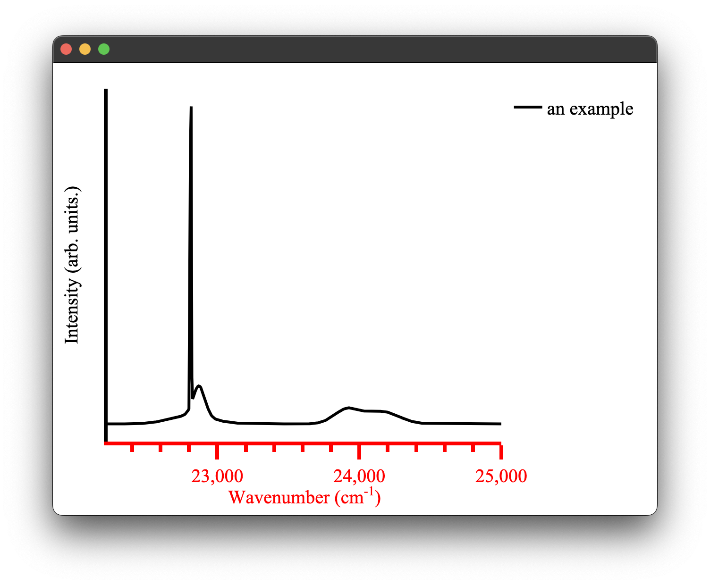

# Configuring plots

There are a few ways to change the configuration of plots in `pyet-mc`. The most straight forward one is to directly pass layout arguments when creating our plot type. These layout arguments are just standard `Plotly` arguments and you can refer to their documentation for a full list of them. However, I shall show a few common examples. 

The obvious one would be that the automatic `x-axis` range calculation of `pyet-mc` might not be quite what you want it to be. This can be easily changed by overwriting the defaults as we just discussed. 
```python
wavelengths = np.arange(400,450, 0.1) #generate some values between 400 and 450 nm
wavenumbers, signal = random_spectra(wavelengths, wavenumbers=True)
x_range = [23000,23500]
ticks = 50
figure = Plot(xaxis={'range': x_range,'dtick': 100})
figure.spectra(wavenumbers, signal, name = 'an example') #give the data a name for the legend
figure.show()
```

<p align="center">
 
</p>

It is also easy to update the style of the data on the plot using a similar method:

```
wavelengths = np.arange(400,450, 0.1) #generate some values between 400 and 450 nm
wavenumbers, signal = random_spectra(wavelengths, wavenumbers=True)
x_range = [23000,23500]
ticks = 50
figure = Plot(xaxis={'range': x_range,'dtick': 100,})
figure.spectra(wavenumbers, signal, name='an example', mode='markers', marker={'color': 'red'}) 
figure.show()

```

<p align="center">
 
</p>

While it is quite easy to specify a marker mode or colour for each dataset on a plot inline like the examples above, it becomes quite obtuse to do this for the plot layout configuration as there are far more options. This is greatly exemplified when you have multiple Python files plotting different sets of data but you want them to all have the same formatting, say for a thesis or publication. In `pyet-mc` a configuration method was introduced to simplify the layout configuration of `Plotly` plots.  This is where all the default plot layouts are configured and, therefore, aren't hard-coded into the plotting functionality directly. When the plotting library is loaded it also loads this config file. Any arguments passed to the `Plot()` class overwrite it. However, it also means you can just directly modify this file and all your plots will be created with this layout by default!

The config file is a simple `.toml` file type, 
and the general layout of the `plotting_congfig.toml` file is:
```toml
[spectra_layout]
  title_text = ""
  showlegend = true
  title = ''
  margin = { l = 50, r = 50, t = 20, b = 70 }
  paper_bgcolor = "white"

  [spectra_layout.font]
    family = 'Times New Roman, monospace'
    size = 20
    color = 'black'

  [spectra_layout.xaxis]
    title = 'Wavenumber (cm<sup>-1</sup>)'
    exponentformat = 'none'
    showgrid = false
    showline = true
    tickmode = 'linear'
    ticks = 'outside'
    showticklabels = true
    linewidth = 4
    linecolor = 'black'
    ticklen = 15
    tickwidth = 4
    tickcolor = 'black'


    ...
```
where each of the three currently available plotting types has their layouts configured here. A full example of this file can be found in the `src/pyet/plotting_config/` directory of the package on `Github` or wherever your Python package manager installed the library. You can directly edit the file there once the package has been installed. This is not the recommended way to provide a user-configured config file as it runs the risk of completely breaking the functionality of the library if you misconfigure it with no ability to fall back (unless, of course, you make a copy of the file or re-download it from this repo). Instead, you can use a `pyet-utils` function called `load_local_config` to load a local configuration from a specified directory. In this example we will change the `x-axis` colour scheme to red in our local config file. 

```toml
[spectra_layout]
  title_text = ""
  showlegend = true
  title = ''
  margin = { l = 50, r = 50, t = 20, b = 70 }
  paper_bgcolor = "white"

  [spectra_layout.font]
    family = 'Times New Roman, monospace'
    size = 20
    color = 'black'

  [spectra_layout.xaxis]
    title = 'Wavenumber (cm<sup>-1</sup>)'
    exponentformat = 'none'
    showgrid = false
    showline = true
    tickmode = 'linear'
    ticks = 'outside'
    dtick = 50
    showticklabels = true
    linewidth = 4
    linecolor = 'red'
    ticklen = 15
    tickwidth = 4
    tickcolor = 'red'
    
    [spectra_layout.xaxis.minor]
      ticks = 'outside'
      ticklen = 7
      showgrid = false

    [spectra_layout.xaxis.tickfont]
      family = 'Times new roman, monospace'
      size = 20
      color = 'red'

    [spectra_layout.xaxis.titlefont]
      family = 'Times new roman, monospace'
      size = 20
      color = 'red'
```
By simply adding the `load_local_config` function we can update our plots:

```python
load_local_config('/path/to/your/local_plotting_config.toml')
figure = Plot()
figure1.spectra(wavenumbers, signal, name='an example') 
figure.show()
```
<p align="center">
 
</p>

easy as that!

This can be done for all three plot types. A complete list of optional layout features can be found in `Ploty's` documentation for the parent plot type of the three plots currently implemented in this library. 