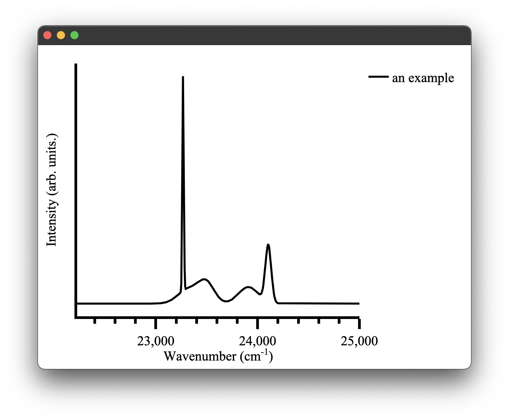

# Spectra plots
A spectra plot is a simple `x,y` plot of spectroscopic data with sensible defaults. It will for example, automatically find an appropriate major and minor tick spacing. It defaults to using wavenumbers as the `x` axis as that is what we commonly use in our research group. This can be easily overridden, however (see [configuring plots](#configuring-plots)) the goal is to be able to produce fast plots of spectra with sensible defaults that can be stylized to your tastes after. 
We can create a spectra plot simply with this code:
```python
from pyet.plotting import Plot
from pyet.pyet_utils import random_spectra
if __name__ == "__main__":
    wavelengths = np.arange(400,450, 0.1) #generate some values between 400 and 450 nm
    wavenumbers, signal = random_spectra(wavelengths, wavenumbers=True)
    figure = Plot()
    figure.spectra(x, y, name = 'an example') #give the data a name for the legend
    figure.show()
```

which gives us the following figure:

<p align="center">
 
</p>
