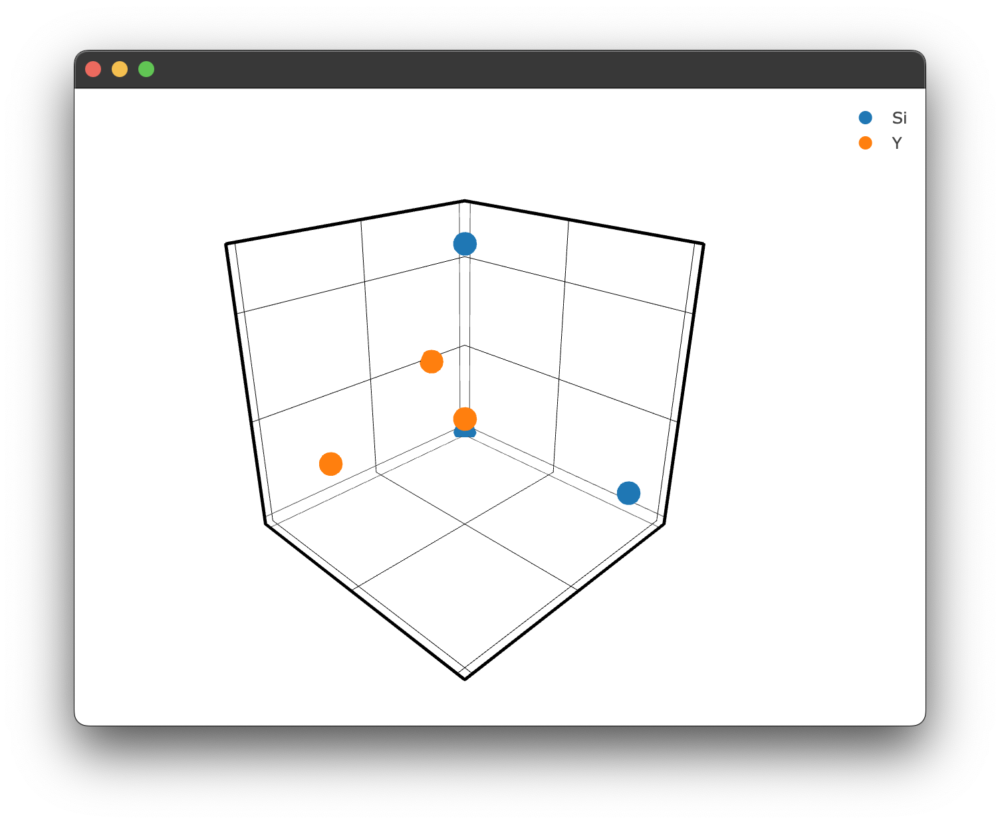

# Structure plots
The structure plots use Ploty's `go.Scatter3d` as their base. Unlike the previous two plot types, the structure plotting is handled by the `structure3d` plotting method, which is in turn wrapped by the `Structure` and `Interaction` plotting methods. These two methods leverage `structure3d` and its defaults to produce the structure plots we have seen earlier. It is however possible to bypass those structure plots if you don't have a `.cif` file or you want to write your own more general 3D plot. 

To create a 3D plot without using a `.cif` file and `Structure.structure_plot()` or `Interaction.doped_structure_plot()` we simply need to use the methods we used for the `spectra` & `transient` plot types:

```python
figure = Plot()

figure.structure_3d([0,1,2],[0,5,2],[0,1,5], name = 'Si')
figure.structure_3d([5,1,1],[2,0,1],[2,2,1], name='Y')
figure.show()
```
which gives us the following figure:

<p align="center">
 
</p>