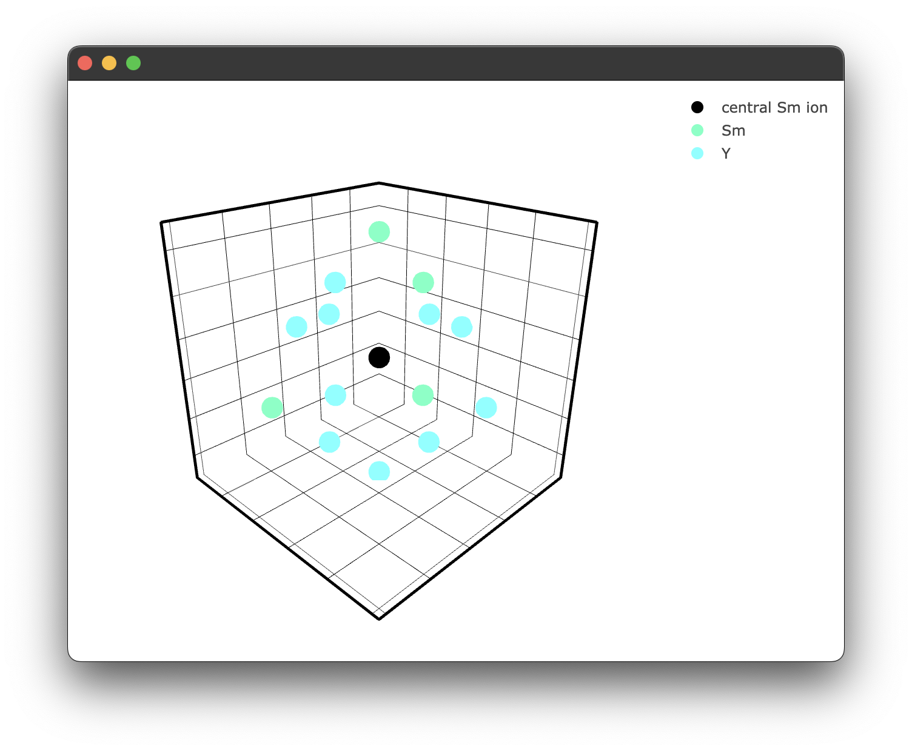

# Modelling energy transfer processes
Note: Currently, only one energy transfer process has been implemented, so this section may be subject to change in future releases. 

Consider the crystal structure we previously generated. We wish to "dope" that structure with some lanthanide ions randomly around some central donor ion. We will replace our previously defined "central yttrium atom" with a samarium. We will then randomly (based on the concentration of the dopant in the crystal) dope samarium ions around this central samarium ion. This step must be performed many times to "build up" many random unique samarium-samarium donor-acceptor configurations. When the number of random configurations is large enough, this should accurately represent a physical crystal sample. This is the Monte-Carlo aspect of our energy transfer analysis. 

To generate our random samples, we utilise the interaction class. This class takes in our structure class and provides additional methods for calculating our interaction components and more specific plotting methods for doped crystals. We can enact this class simply by passing our structure to the interaction class:
```python
crystal_interaction = Interaction(KY3F10)
```

```python
coords = crystal_interaction.distance_sim(radius=10, concentration = 15, dopant='Sm3+')
```
This returns a list of radial distances in angstroms of the dopant samarium ions about the central samarium donor ion.
```
[8.28402747 7.17592429 7.17592429 9.33368811 8.28402747 4.30030493
 8.28402747 7.17592429 9.33368811 7.17592429 3.98372254 8.28402747]
```

We can also take a more detailed look at what has happened by calling 
```python
print(coords.filtered_coords)
```
```
           r       theta           phi species
0   7.175924  115.071364 -1.156825e+02       Y3+
1   7.175924  115.071364 -1.543175e+02       Y3+
2   8.284027   90.000000 -1.350000e+02       Y3+
3   7.175924   66.886668 -1.525658e+02       Y3+
4   7.175924   66.886668 -1.174342e+02       Y3+
5   9.192125  109.317471 -1.800000e+02       Y3+
6   5.861968   92.188550 -1.800000e+02       Y3+
7   9.333688  162.434187 -1.800000e+02       Y3+
8   8.284027  135.000000  1.800000e+02      Sm3+
9   7.175924  115.071364  1.156825e+02      Sm3+
10  7.175924  115.071364  1.543175e+02       Y3+
11  4.300305  135.000000 -1.800000e+02       Y3+
12  3.983723   45.000000 -1.800000e+02       Y3+
13  7.175924   66.886668  1.525658e+02      Sm3+
14  9.333688   72.434187 -1.800000e+02      Sm3+
15  8.284027   45.000000 -1.800000e+02       Y3+
16  9.192125   19.317471 -1.800000e+02       Y3+
17  8.284027   90.000000  1.350000e+02       Y3+
18  7.175924   66.886668  1.174342e+02       Y3+
19  9.192125  109.317471 -9.000000e+01       Y3+
20  5.861968   92.188550 -9.000000e+01       Y3+
```
As we can see, some of the yttrium ions have been replaced by samarium ions, as expected. 
We can also plot this to see what is happening visually; the interaction class has similar plotting functionality. 
```python
if __name__ == "__main__":
    fig3 = crystal_interaction.doped_structure_plot(radius=7.0, concentration = 15.0 , dopant = 'Sm3+' , filter = ['Y3+','Sm3+'])
    fig3.show()
```

yielding the following figure:
<p align="center">
 
</p>

We can now calculate our interaction component for each random doping configuration. This is handled by the sim method, which currently is referred to as sim_single_cross as it is the only implemented method at the time of writing. However, it is possible to add your own by wrapping 'distance_method' described above for cooperative processes, for example. 

```python
interaction_components2pt5pct = crystal_interaction.sim_single_cross(radius=10, concentration = 2.5, interaction_type='DQ', iterations=20)
```
The sim method takes a radius, concentration, interaction type and number of iterations. The interaction type is given by a two-letter code, i.e. 'DQ' equals dipole-quadrupole. 
We will need more iterations than just 20 for fitting, closer to 50,0000. If we rerun this now with 50,0000 iterations, we get the following response:
```
file found in cache, returning interaction components
```
This is because I have already run this command, which has been cached. See the notes on caching [here](caching.md#a-note-on-caching).
The sim returns a Numpy array of interaction components that matches the number of iterations and will be utilised in our fitting process next! 

We can then generate another set of interaction components for a 5% doped sample simply by changing the concentration
```python
interaction_components5pct = crystal_interaction.sim_single_cross(radius=10, concentration = 5, interaction_type='DQ', iterations=50000)
```
The crystal interaction simulation can also accept the boolean flag `intrinsic = True`; this uses a modified formulation of the interaction components in the form $$\gamma_{tr,j} = C_{cr} \sum_i \left(\frac{1}{R_i}\right)^s.$$

This gives us the energy transfer rate ($C_{cr}$) or average energy transfer rate ($\gamma_{av}$) in terms of a dopant ion 1 &#8491; from the donor ion. The relevance of this is for work regarding an intrinsic energy rate. It is set to false by default as it is not as relevant at this stage; however, in future, it may be of interest. 
