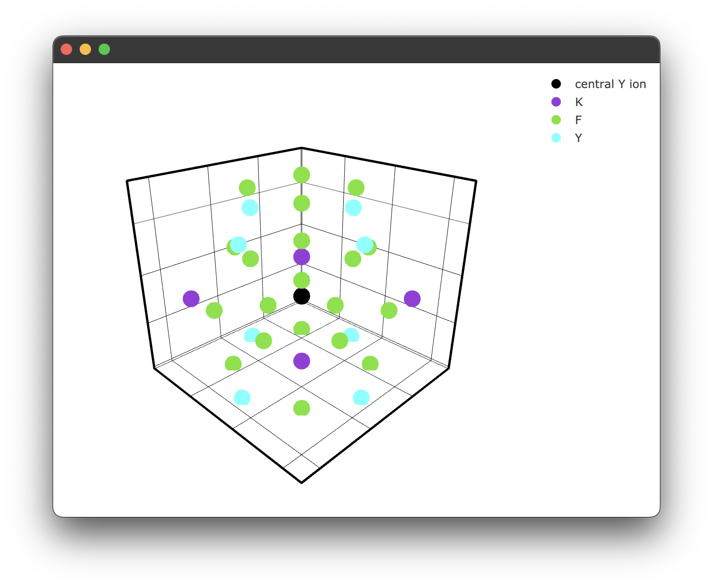
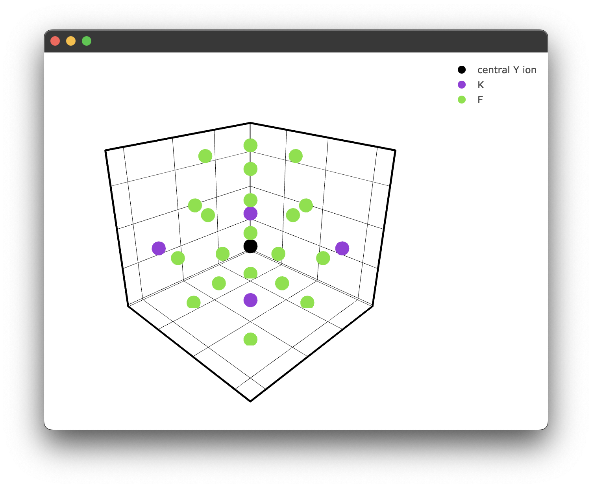

# Generating a structure & plotting

**Note** a complete example of the following code can be found [here](https://github.com/JaminMartin/pyet-mc/tree/main/examples)
## Generating a structure & plotting
Firstly, a .cif file must be provided. How you provide this .cif file is up to you! We will take a .cif file from the materials project website for this example. However, they also provide a convenient API that can also be used to provide .cif data. It is highly recommended as it provides additional functionality, such as XRD patterns. Information on how to access this API can be found here: https://next-gen.materialsproject.org/api. 
We can create our structure with the following code. However, this may differ if you are using the materials project API. It is also important to ensure your .cif file is using the conventional standard. 
```python
KY3F10 = Structure(cif_file= 'KY3F10.cif')
```
We then need to specify a central ion, to which all subsequent information will be calculated in relation to. It is important to note, we must specify the charge of the ion as well.
```python
KY3F10.centre_ion('Y3+')
```
This will set the central ion to be a Ytrrium ion and yield the following output:
```
central ion is [-5.857692   -5.857692   -2.81691722] Y3+
with a nearest neighbour Y3+ at 3.914906764969714 angstroms
```
This gives us the basic information about the host material. 
Now we can request some information! We can now query what ions and how far away they are from that central ion within a given radius. 
This can be done with the following:

```python
KY3F10.nearest_neighbours_info(3.2)
``` 
Output:
```
Nearest neighbours within radius 3.2 Angstroms of a Y3+ ion:
Species = F, r = 2.386628 Angstrom
Species = F, r = 2.227665 Angstrom
Species = F, r = 2.386628 Angstrom
Species = F, r = 2.227665 Angstrom
Species = F, r = 2.386628 Angstrom
Species = F, r = 2.227665 Angstrom
Species = F, r = 2.227665 Angstrom
Species = F, r = 2.386628 Angstrom

```
We can plot this if we like, but we will increase the radius for illustrative purposes. We can use the inbuilt plotting for this.
```python
if __name__ == "__main__":
    fig1 = KY3F10.structure_plot(radius = 5)  
    fig1.show() 
```
Which yields the following figure:
<p align="center">
 
</p>

It's worth noting here briefly that due to the way the `PyWebEngine` App is being rendered using the multiprocessing library, it is essential to include the `if __name__ == "__main__":` block. Unfortunately, until a different backend for rendering the `Plotly` `.html` files that also supports `javascript` this has to stay. 
We can also specify a filter only to show ions we care about. For example, we may only care about the fluoride ions. 
```python
if __name__ == "__main__":
  filtered_ions = ['F-', 'K+'] #again, note we must specify the charge!

  fig2 = KY3F10.structure_plot(radius = 5, filter = filtered_ions)  
  fig2.show() 
```
This gives us a filtered plot:
<p align="center">
 
</p>
